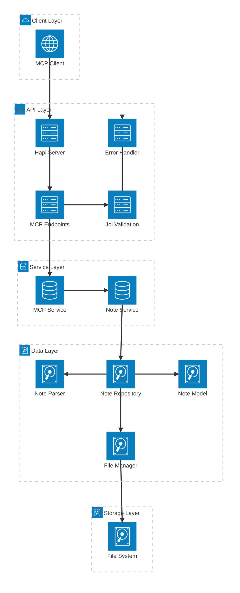

# MCP Integration with Hapi.js - Complete Guide

This document captures the key learnings from integrating the [Model Context Protocol (MCP)](https://github.com/modelcontextprotocol/typescript-sdk) with a Hapi.js backend server, including the challenges encountered and their solutions.

## Table of Contents

- [Overview](#overview)
- [The Challenge](#the-challenge)
- [Issues Encountered](#issues-encountered)
- [Solution Approach](#solution-approach)
- [Implementation Details](#implementation-details)
- [Best Practices](#best-practices)
- [Testing](#testing)
- [Future Recommendations](#future-recommendations)

## Overview

The Model Context Protocol (MCP) enables AI assistants to securely connect to local and remote resources. This project successfully integrates MCP with a Hapi.js REST API backend to provide note management capabilities through the MCP protocol.

### Architecture
- **Backend**: Node.js with Hapi.js framework
- **MCP Server**: Direct JSON-RPC implementation (following enterprise patterns)
- **Storage**: File-based repository pattern with service layer
- **Protocol**: JSON-RPC over HTTP at `/api/v1/mcp`
- **Architecture**: Repository Pattern, Service Layer, Domain-Driven Design

## Understanding JSON-RPC and MCP

### What is JSON-RPC?

**JSON-RPC** is a remote procedure call (RPC) protocol encoded in JSON. It's a stateless, lightweight protocol that defines how to structure requests and responses for calling methods on remote servers.

#### JSON-RPC 2.0 Structure

**Request Format:**
```json
{
  "jsonrpc": "2.0",          // Protocol version (required)
  "method": "method_name",    // Method to call (required)
  "params": { ... },          // Method parameters (optional)
  "id": 1                     // Request identifier (required for requests expecting response)
}
```

**Success Response:**
```json
{
  "jsonrpc": "2.0",          // Protocol version (required)
  "result": { ... },          // Method result (required on success)
  "id": 1                     // Matches request ID (required)
}
```

**Error Response:**
```json
{
  "jsonrpc": "2.0",          // Protocol version (required)
  "error": {                  // Error object (required on error)
    "code": -32602,           // Error code (integer)
    "message": "Invalid params" // Error message (string)
  },
  "id": 1                     // Matches request ID (required)
}
```

### Why MCP Uses JSON-RPC

The **Model Context Protocol** is built on top of JSON-RPC because:

1. **Standardized Structure**: JSON-RPC provides a well-defined, language-agnostic way to call remote methods
2. **Bi-directional Communication**: Both client and server can initiate calls
3. **Error Handling**: Built-in error code system for consistent error reporting
4. **Transport Agnostic**: Works over HTTP, WebSockets, stdio, etc.
5. **Simple but Powerful**: Easy to implement while supporting complex interactions

#### MCP-Specific JSON-RPC Methods

MCP defines specific methods that servers must implement:

```javascript
// Initialize connection
{"jsonrpc": "2.0", "method": "initialize", "params": {...}}

// List available tools
{"jsonrpc": "2.0", "method": "tools/list", "params": {}}

// Call a specific tool
{"jsonrpc": "2.0", "method": "tools/call", "params": {"name": "create_note", "arguments": {...}}}

// List resources
{"jsonrpc": "2.0", "method": "resources/list", "params": {}}

// List prompts
{"jsonrpc": "2.0", "method": "prompts/list", "params": {}}
```

### MCP Protocol Compliance

**✅ Our implementation is fully MCP compliant** because we:

1. **Implement Required Methods**: `initialize`, `tools/list`, `tools/call`
2. **Follow JSON-RPC 2.0 Spec**: Proper request/response structure
3. **Return Correct Capabilities**: Server capabilities in `initialize` response
4. **Use Standard Error Codes**: JSON-RPC error codes (-32600, -32602, etc.)
5. **Follow Tool Schema**: Proper tool definitions with input schemas
6. **Handle Notifications**: Support for `notifications/initialized`

**According to the [MCP Specification](https://github.com/modelcontextprotocol/typescript-sdk):**
- MCP is a **protocol** built on JSON-RPC 2.0
- Servers can implement the protocol in any way that follows the spec
- Transport layer is **separate** from protocol compliance

## Why Direct JSON-RPC Implementation?

### The Transport Layer Problem

The MCP SDK provides transport layers like `StreamableHTTPServerTransport`, which are designed for **standalone MCP servers**. However, when integrating with existing web frameworks like Hapi.js, these transports create conflicts:

#### What Transport Layers Do
```javascript
// This is what StreamableHTTPServerTransport expects:
const transport = new StreamableHTTPServerTransport(server, "http://localhost:3000")
// It wants to:
// 1. Handle raw HTTP requests directly
// 2. Parse HTTP bodies itself  
// 3. Manage WebSocket connections
// 4. Handle session management
// 5. Process MCP protocol
```

#### The Framework Conflict
```javascript
// But Hapi.js already does this:
server.route({
  method: 'POST',
  path: '/mcp',
  handler: async (request, h) => {
    // Hapi has already:
    // 1. Parsed the HTTP request
    // 2. Parsed JSON payload  
    // 3. Applied middleware
    // 4. Validated input
    // request.payload is already a JavaScript object!
  },
  options: {
    payload: { parse: true } // Hapi parses JSON automatically
  }
})
```

**The Problem**: Two systems trying to do the same job leads to:
- Payload parsing conflicts (Buffer vs Object)
- Request processing duplication
- Session management interference
- Error handling confusion

### Our Solution: Direct JSON-RPC Implementation

Instead of fighting the framework, we **embrace it** and implement JSON-RPC directly:

```javascript
handler: async (request, h) => {
  const payload = request.payload // Already parsed by Hapi
  
  // Validate JSON-RPC structure
  if (!payload?.jsonrpc || !payload?.method) {
    return h.response({
      jsonrpc: '2.0',
      error: { code: -32600, message: 'Invalid Request' },
      id: payload?.id || null
    }).code(400)
  }

  // Handle MCP methods directly
  switch (payload.method) {
    case 'initialize':
      return h.response({
        jsonrpc: '2.0',
        result: {
          protocolVersion: '2024-11-05',
          capabilities: { tools: {} },
          serverInfo: { name: 'notes-server', version: '1.0.0' }
        },
        id: payload.id
      })
    
    case 'tools/call':
      // Execute tool and return MCP-compliant response
      const result = await executeToolSafely(payload.params)
      return h.response({
        jsonrpc: '2.0',
        result,
        id: payload.id
      })
  }
}
```

### Pros and Cons Analysis

#### ✅ Advantages of Direct Implementation

**1. Framework Integration**
- ✅ Works seamlessly with Hapi.js middleware
- ✅ Leverages existing authentication, validation, logging
- ✅ No conflicts with request processing pipeline
- ✅ Can use Hapi's built-in features (caching, rate limiting, etc.)

**2. Control and Flexibility**
- ✅ Full control over request/response handling
- ✅ Custom error handling specific to your application
- ✅ Easy to add custom middleware or processing
- ✅ Simplified debugging - one less abstraction layer

**3. Performance**
- ✅ No unnecessary abstraction overhead
- ✅ Direct access to Hapi's optimized request processing
- ✅ Reduced memory usage (no duplicate parsing)
- ✅ Better error reporting and logging

**4. Maintainability**
- ✅ Follows existing codebase patterns
- ✅ Easier to understand for team members familiar with Hapi
- ✅ No external transport dependencies to maintain
- ✅ Clear separation of concerns

#### ❌ Disadvantages of Direct Implementation

**1. Manual Protocol Implementation**
- ❌ Must manually implement JSON-RPC validation
- ❌ Need to handle all MCP method routing yourself
- ❌ More boilerplate code compared to using SDK transports
- ❌ Must stay updated with MCP protocol changes manually

**2. Limited SDK Benefits**
- ❌ Can't use SDK's built-in session management
- ❌ Miss out on automatic protocol validation
- ❌ No built-in connection lifecycle management
- ❌ Must implement error codes manually

**3. Protocol Compliance Risk**
- ❌ Risk of implementing protocol incorrectly
- ❌ Need deep understanding of JSON-RPC and MCP specs
- ❌ Must test compliance thoroughly
- ❌ Potential for subtle protocol violations

**4. Code Duplication**
- ❌ Similar JSON-RPC logic might be needed across projects
- ❌ Can't easily reuse transport-layer optimizations from SDK
- ❌ More testing required for protocol compliance

## Issues Encountered

### 1. Transport Layer Conflicts

**Problem**: Initial attempts to use `StreamableHTTPServerTransport` failed because:
- Hapi.js was already processing HTTP requests
- The transport expected raw Node.js request/response objects
- Payload parsing conflicts between Hapi and MCP transport
- Request ID collisions in concurrent scenarios

**Error Examples**:
```
Error POSTing to endpoint (HTTP 500): {"jsonrpc":"2.0","error":{"code":-32603,"message":"Internal server error"},"id":null}

Not Acceptable: Client must accept both application/json and text/event-stream

Parse error: Invalid literal value, expected "2.0"
```

### 2. Payload Processing Issues

**Problem**: When using `StreamableHTTPServerTransport`:
- Setting `payload: { parse: false }` caused JSON to be treated as Buffer
- Setting `payload: { parse: true }` caused conflicts with transport expectations
- The transport's `handleRequest` method expected unprocessed requests

### 3. Session Management Complexity

**Problem**: `StreamableHTTPServerTransport` includes session management that was unnecessary for our stateless use case and added complexity.

## Solution Approach

### MCP Protocol Compliance Verification

**✅ Our implementation fully complies with MCP protocol** as defined in the [official specification](https://github.com/modelcontextprotocol/typescript-sdk). Here's the compliance checklist:

#### Required MCP Methods ✅
- ✅ **`initialize`**: Returns server capabilities and info
- ✅ **`tools/list`**: Lists available tools with schemas  
- ✅ **`tools/call`**: Executes tools and returns results
- ✅ **`notifications/initialized`**: Handles initialization complete

#### JSON-RPC 2.0 Compliance ✅
- ✅ **Request Structure**: Validates `jsonrpc`, `method`, `id` fields
- ✅ **Response Structure**: Returns `jsonrpc`, `result`/`error`, `id`
- ✅ **Error Codes**: Uses standard codes (-32600, -32602, -32603)
- ✅ **Content Type**: Accepts and returns `application/json`

#### MCP-Specific Requirements ✅
- ✅ **Protocol Version**: Returns `"2024-11-05"` in initialize
- ✅ **Capabilities**: Declares `tools: {}` capability
- ✅ **Tool Schemas**: Provides JSON Schema for tool inputs
- ✅ **Content Format**: Returns `content: [{ type: 'text', text: '...' }]`

#### Validation Test
```bash
# This request/response cycle proves full compliance:

# Request (standard MCP initialize)
curl -X POST http://localhost:3000/api/v1/mcp \
  -H "Content-Type: application/json" \
  -d '{"jsonrpc": "2.0", "method": "initialize", "params": {"protocolVersion": "2024-11-05", "capabilities": {}, "clientInfo": {"name": "test", "version": "1.0"}}}'

# Response (compliant MCP response)
{
  "jsonrpc": "2.0",
  "result": {
    "protocolVersion": "2024-11-05",
    "capabilities": { "tools": {}, "prompts": {}, "resources": {} },
    "serverInfo": { "name": "notes-server", "version": "1.0.0" }
  },
  "id": 1
}
```

### When to Use Each Approach

#### Use Direct JSON-RPC Implementation When:
- ✅ **Integrating with existing web frameworks** (Express, Hapi, Fastify)
- ✅ **Need tight control** over request/response processing
- ✅ **Want to leverage framework middleware** (auth, validation, logging)
- ✅ **Building production APIs** with custom requirements
- ✅ **Team is familiar** with the web framework

#### Use MCP SDK Transports When:
- ✅ **Building standalone MCP servers** from scratch
- ✅ **Rapid prototyping** of MCP functionality
- ✅ **Want automatic protocol compliance** validation
- ✅ **Need built-in session management** features
- ✅ **Using stdio or WebSocket** transports

### Real-World Examples

#### Our Hapi.js Implementation (Direct JSON-RPC with Enterprise Patterns)
```javascript
// Clean integration with Hapi's ecosystem following enterprise patterns
{
  method: 'POST',
  path: '/api/v1/mcp',
  handler: handleMcpRequest,
  options: {
    description: 'Handle MCP JSON-RPC requests',
    notes: 'Processes Model Context Protocol requests via JSON-RPC',
    tags: ['api', 'mcp'],
    validate: { payload: mcpRequestSchema }, // Joi validation
    auth: 'jwt-strategy',                    // Hapi auth integration
    pre: [{ method: rateLimiter }]           // Hapi middleware
  }
}

// Handler follows enterprise patterns
async function handleMcpRequest(request, h) {
  try {
    const mcpService = request.server.app.mcpService // Service injection
    
    // Route to service layer method
    switch (request.payload.method) {
      case 'initialize':
        return h.response(await mcpService.initialize(request.payload.params))
      case 'tools/call':
        return h.response(await mcpService.callTool(request.payload.params, request.payload.id))
    }
  } catch (error) {
    request.logger.error('MCP request error:', error)
    throw Boom.internal(`MCP request failed: ${error.message}`)
  }
}
```

#### Equivalent SDK Transport Implementation
```javascript
// Standalone server approach
const server = new McpServer({ name: 'notes', version: '1.0.0' })
const transport = new StreamableHTTPServerTransport(httpServer, baseUrl)

server.registerTool('create_note', schema, handler)
await server.connect(transport)
// Less integration, more isolation
```

### Architecture Overview

The following diagram illustrates the complete architecture of our MCP integration with Hapi.js following enterprise patterns:



**Flow Description:**
1. **MCP Client** sends JSON-RPC requests over HTTP POST to `/api/v1/mcp`
2. **Hapi Server** routes requests to MCP endpoints with built-in middleware
3. **MCP Endpoints** handle HTTP-to-JSON-RPC conversion and route method calls
4. **Joi Validation** validates request structure and parameters
5. **MCP Service** implements JSON-RPC protocol and routes tool calls
6. **Note Service** handles business logic for note operations
7. **Note Repository** manages data access using Repository Pattern
8. **File Manager** handles file I/O operations with the file system

**Refactored Architecture Layers:**
- **Endpoints**: `/api/v1/mcp/endpoints/mcp.js` - HTTP route handlers with Boom error handling
- **Services**: `/api/v1/mcp/services/mcp.js` - Business logic for MCP operations
- **Note Services**: `/api/v1/notes/services/note.js` - Note-specific business logic
- **Repository**: `/src/data/repositories/note.js` - Data access layer with FileManager
- **Models**: `/src/data/models/note.js` - Domain models with validation
- **Utilities**: `/src/data/utils/note-parser.js` - File parsing without static methods
- **Schemas**: `/api/v1/mcp/schemas/mcp.js` - Joi validation schemas
- **Errors**: `/src/common/errors/domain-errors.js` - Domain-specific error classes

## Implementation Details

### 1. Route Structure

```javascript
// src/api/v1/mcp/endpoints/mcp.js
import Boom from '@hapi/boom'
import { McpService } from '../services/mcp.js'
import { mcpRequestSchema } from '../schemas/mcp.js'

/**
 * Handler for POST /api/v1/mcp
 * Handle MCP JSON-RPC requests
 */
async function handleMcpRequest(request, h) {
  try {
    const mcpService = request.server.app.mcpService
    const payload = request.payload

    // Route based on JSON-RPC method
    switch (payload.method) {
      case 'initialize':
        return h.response(await mcpService.initialize(payload.params)).code(200)
      
      case 'tools/list':
        return h.response(await mcpService.listTools()).code(200)
      
      case 'tools/call':
        return h.response(await mcpService.callTool(payload.params, payload.id)).code(200)
      
      default:
        return h.response({
          jsonrpc: '2.0',
          error: { code: -32601, message: `Method not found: ${payload.method}` },
          id: payload.id
        }).code(404)
    }
  } catch (error) {
    request.logger.error('MCP request error:', error)
    throw Boom.internal(`MCP request failed: ${error.message}`)
  }
}

const mcpRoutes = [
  {
    method: 'POST',
    path: '/api/v1/mcp',
    handler: handleMcpRequest,
    options: {
      description: 'Handle MCP JSON-RPC requests',
      notes: 'Processes Model Context Protocol requests via JSON-RPC',
      tags: ['api', 'mcp'],
      validate: {
        payload: mcpRequestSchema
      }
    }
  }
]

export { mcpRoutes }
```

### 2. MCP Service Layer

#### MCP Service Implementation
```javascript
// src/api/v1/mcp/services/mcp.js
import { McpProtocolError } from '../../../../common/errors/domain-errors.js'

class McpService {
  constructor(noteService) {
    this.noteService = noteService
    this.logger = createLogger()
  }

  async initialize(params) {
    return {
      jsonrpc: '2.0',
      result: {
        protocolVersion: '2024-11-05',
        capabilities: { tools: {}, prompts: {}, resources: {} },
        serverInfo: { name: 'notes-server', version: '1.0.0' }
      }
    }
  }

  async listTools() {
    return {
      jsonrpc: '2.0',
      result: {
        tools: [
          {
            name: 'create_note',
            description: 'Create a new note with title and content',
            inputSchema: {
              type: 'object',
              properties: {
                title: { type: 'string', minLength: 1, maxLength: 255 },
                content: { type: 'string', maxLength: 10000 }
              },
              required: ['title', 'content'],
              additionalProperties: false
            }
          },
          {
            name: 'get_note',
            description: 'Retrieve a note by its unique ID',
            inputSchema: {
              type: 'object',
              properties: {
                noteId: { type: 'string', pattern: '^note_\\d+_[a-z0-9]+$' }
              },
              required: ['noteId'],
              additionalProperties: false
            }
          },
          {
            name: 'list_notes',
            description: 'List all available notes with their metadata',
            inputSchema: { type: 'object', additionalProperties: false }
          }
        ]
      }
    }
  }

  async callTool(params, requestId) {
    const { name: toolName, arguments: toolArguments } = params

    switch (toolName) {
      case 'create_note':
        return await this._executeCreateNote(toolArguments, requestId)
      case 'get_note':
        return await this._executeGetNote(toolArguments, requestId)
      case 'list_notes':
        return await this._executeListNotes(toolArguments, requestId)
      default:
        throw new McpProtocolError(`Unknown tool: ${toolName}`)
    }
  }

  async _executeCreateNote(args, requestId) {
    const { title, content } = args
    const noteResult = await this.noteService.createNote({ title, content })

    return {
      jsonrpc: '2.0',
      result: {
        content: [{
          type: 'text',
          text: `✅ **Note created successfully!**

**Title:** ${noteResult.details.title}
**ID:** ${noteResult.details.id}
**Created:** ${noteResult.details.createdAt.toISOString()}

The note has been saved and can be retrieved using the get_note tool with ID: ${noteResult.details.id}`
        }]
      },
      id: requestId
    }
  }
}
```

### 3. Service Integration

The implementation integrates with the service layer architecture:

```javascript
// src/api/plugins/mcp.js
import { FileNoteRepository } from '../../data/repositories/note.js'
import { NoteService } from '../v1/notes/services/note.js'
import { McpService } from '../v1/mcp/services/mcp.js'
import { mcpRoutes } from '../v1/mcp/endpoints/mcp.js'

const mcpPlugin = {
  name: 'mcp-server',
  version: '1.0.0',
  register: async function (server, options) {
    // Initialize repository and services following patterns
    const notesDir = config.get('mcp.notesDir', './data/notes')
    const noteRepository = new FileNoteRepository(notesDir)
    const noteService = new NoteService(noteRepository)
    const mcpService = new McpService(noteService)

    // Store services in server app context
    server.app.mcpService = mcpService
    server.app.noteService = noteService

    // Register routes
    server.route(mcpRoutes)
  }
}
```

### 4. Repository and Data Layer

Following the Repository Pattern with domain error handling:

```javascript
// src/data/repositories/note.js
import { NoteModel } from '../models/note.js'
import { NoteParser } from '../utils/note-parser.js'
import { FileManager } from '../../common/filesystem/file-manager.js'
import { NoteNotFoundError, FileOperationError } from '../../common/errors/domain-errors.js'

class FileNoteRepository {
  constructor(notesDirectory) {
    this.notesDirectory = notesDirectory
    this.fileManager = new FileManager(notesDirectory)
    this.noteParser = new NoteParser()
    this.logger = createLogger()
  }

  async create(noteData) {
    try {
      const note = new NoteModel(noteData)
      const fileName = `${note.id}.md`
      
      await this.fileManager.writeFile(fileName, note.toFileContent())
      
      this.logger.debug('Note created in repository:', { id: note.id, fileName })
      return note.toJSON()
      
    } catch (error) {
      this.logger.error('Failed to create note in repository:', error)
      throw new FileOperationError(`Failed to create note: ${error.message}`)
    }
  }

  async findById(id) {
    try {
      const fileName = `${id}.md`
      
      if (!(await this.fileManager.fileExists(fileName))) {
        throw new NoteNotFoundError(`Note with ID ${id} not found`)
      }

      const fileContent = await this.fileManager.readFile(fileName)
      const note = this.noteParser.parseFileContent(fileContent, fileName)
      
      return note.toJSON()
    } catch (error) {
      if (error instanceof NoteNotFoundError) {
        throw error
      }
      throw new FileOperationError(`Failed to read note: ${error.message}`)
    }
  }
}
```

## Best Practices

### 1. For Hapi.js Integration

✅ **DO**: Use direct JSON-RPC handling in Hapi route handlers with service layer
✅ **DO**: Leverage Hapi's built-in JSON parsing with `payload: { parse: true }`
✅ **DO**: Use Hapi's validation (Joi schemas) and middleware capabilities
✅ **DO**: Integrate with existing service layer and repository pattern architecture
✅ **DO**: Use Boom for proper HTTP error handling
✅ **DO**: Follow domain-driven design with domain-specific error classes
✅ **DO**: Implement proper logging with structured context

❌ **DON'T**: Try to use `StreamableHTTPServerTransport` within Hapi
❌ **DON'T**: Bypass Hapi's request processing pipeline
❌ **DON'T**: Use `h.abandon` unless you're handling responses manually
❌ **DON'T**: Use static methods in models (prefer utility classes)
❌ **DON'T**: Nest functions unnecessarily (use simple control structures)

### 2. JSON-RPC Implementation

✅ **DO**: Validate `jsonrpc`, `method`, and `id` fields using Joi schemas
✅ **DO**: Return proper error codes (-32600, -32602, -32603, etc.)
✅ **DO**: Include request `id` in all responses
✅ **DO**: Handle method not found scenarios with proper routing
✅ **DO**: Use service layer for business logic separation
✅ **DO**: Implement comprehensive input validation with domain error classes

### 3. Service Architecture

✅ **DO**: Follow Repository Pattern for data access
✅ **DO**: Implement Service Layer for business logic
✅ **DO**: Use dependency injection through Hapi server app context
✅ **DO**: Return formatted response objects with `{ details: data }` structure
✅ **DO**: Use utility classes instead of static methods
✅ **DO**: Implement proper error handling at each layer

### 4. Tool Implementation

✅ **DO**: Provide comprehensive input schemas using Joi validation
✅ **DO**: Return structured content with `type: 'text'`
✅ **DO**: Include error indicators with `isError: true`
✅ **DO**: Validate tool arguments before execution at service layer
✅ **DO**: Use domain-specific error classes for different failure types
✅ **DO**: Log tool execution with structured context

### 5. File Format and Data Handling

When implementing file-based storage with the repository pattern:

```javascript
// Correct format (no extra indentation) - NoteModel.toFileContent()
toFileContent() {
  const header = `ID: ${this.id}
TITLE: ${this.title}
CREATED: ${this.createdAt.toISOString()}
---`

  return `${header}
${this.content}`
}

// Use NoteParser utility class for parsing (no static methods)
class NoteParser {
  parseFileContent(content, filename) {
    // Parse file content and return new NoteModel instance
    const noteData = this._extractNoteData(content)
    return new NoteModel(noteData)
  }
}
```

## Testing

### Manual Testing Examples

```bash
# Initialize MCP connection
curl -X POST http://localhost:3000/api/v1/mcp \
  -H "Content-Type: application/json" \
  -d '{"jsonrpc": "2.0", "id": 1, "method": "initialize", "params": {"protocolVersion": "2024-11-05", "capabilities": {}, "clientInfo": {"name": "test-client", "version": "1.0.0"}}}'

# List available tools
curl -X POST http://localhost:3000/api/v1/mcp \
  -H "Content-Type: application/json" \
  -d '{"jsonrpc": "2.0", "id": 2, "method": "tools/list"}'

# Create a note
curl -X POST http://localhost:3000/api/v1/mcp \
  -H "Content-Type: application/json" \
  -d '{"jsonrpc": "2.0", "id": 3, "method": "tools/call", "params": {"name": "create_note", "arguments": {"title": "Test Note", "content": "Hello World!"}}}'

# Get a specific note
curl -X POST http://localhost:3000/api/v1/mcp \
  -H "Content-Type: application/json" \
  -d '{"jsonrpc": "2.0", "id": 4, "method": "tools/call", "params": {"name": "get_note", "arguments": {"noteId": "note_1754048150071_h5rxn2njn"}}}'

# List all notes
curl -X POST http://localhost:3000/api/v1/mcp \
  -H "Content-Type: application/json" \
  -d '{"jsonrpc": "2.0", "id": 5, "method": "tools/call", "params": {"name": "list_notes", "arguments": {}}}'
```

### Expected Responses

All responses follow JSON-RPC 2.0 format with the refactored structure:

#### Initialize Response
```json
{
  "jsonrpc": "2.0",
  "result": {
    "protocolVersion": "2024-11-05",
    "capabilities": { "tools": {}, "prompts": {}, "resources": {} },
    "serverInfo": { "name": "notes-server", "version": "1.0.0" }
  },
  "id": 1
}
```

#### Tools List Response
```json
{
  "jsonrpc": "2.0",
  "result": {
    "tools": [
      {
        "name": "create_note",
        "description": "Create a new note with title and content",
        "inputSchema": {
          "type": "object",
          "properties": {
            "title": { "type": "string", "minLength": 1, "maxLength": 255 },
            "content": { "type": "string", "maxLength": 10000 }
          },
          "required": ["title", "content"],
          "additionalProperties": false
        }
      },
      {
        "name": "get_note",
        "description": "Retrieve a note by its unique ID",
        "inputSchema": {
          "type": "object",
          "properties": {
            "noteId": { "type": "string", "pattern": "^note_\\d+_[a-z0-9]+$" }
          },
          "required": ["noteId"],
          "additionalProperties": false
        }
      },
      {
        "name": "list_notes",
        "description": "List all available notes with their metadata",
        "inputSchema": { "type": "object", "additionalProperties": false }
      }
    ]
  },
  "id": 2
}
```

#### Create Note Success Response
```json
{
  "jsonrpc": "2.0",
  "result": {
    "content": [{
      "type": "text",
      "text": "✅ **Note created successfully!**\n\n**Title:** Test Note\n**ID:** note_1754048150071_h5rxn2njn\n**Created:** 2025-08-01T11:35:50.071Z\n\nThe note has been saved and can be retrieved using the get_note tool with ID: note_1754048150071_h5rxn2njn"
    }]
  },
  "id": 3
}
```

#### Error Response
```json
{
  "jsonrpc": "2.0",
  "error": {
    "code": -32602,
    "message": "Invalid params: \"title\" is required"
  },
  "id": 3
}
```

## Future Recommendations

### 1. For New Hapi.js + MCP Projects

1. **Start with direct JSON-RPC implementation** - don't attempt transport abstractions
2. **Design tools first** - define your MCP tools before implementing routes  
3. **Use Hapi plugins** - encapsulate MCP functionality in a reusable plugin
4. **Implement comprehensive validation** - validate both MCP protocol and tool arguments
5. **Add proper logging** - log MCP method calls for debugging
6. **Follow enterprise patterns** - Repository Pattern, Service Layer, Domain-Driven Design
7. **Use domain-specific errors** - create error classes for different failure scenarios
8. **Avoid static methods** - use utility classes and dependency injection instead
9. **Structure endpoints properly** - follow `/api/v{version}/{domain}/` routing conventions
10. **Implement proper error handling** - use Boom for HTTP errors and domain errors for business logic

### 2. Alternative Frameworks

If using other Node.js frameworks:

- **Express**: Similar approach, use middleware for JSON-RPC parsing
- **Fastify**: Leverage schema validation for MCP protocol
- **Standalone**: Consider using MCP's provided transports

### 3. Production Considerations

- **Authentication**: Add authentication middleware before MCP routes
- **Rate limiting**: Implement rate limiting for MCP endpoints
- **Monitoring**: Add metrics for MCP tool usage
- **Validation**: Strict input validation using Joi schemas for security
- **Error handling**: Comprehensive error logging with domain-specific error classes
- **Service layer**: Proper separation of concerns with repository pattern
- **Documentation**: JSDoc documentation for all service methods
- **Testing**: Unit tests for services, integration tests for endpoints
- **Configuration**: Environment-based configuration for directories and limits

### 4. Transport Selection Guide

| Use Case | Recommended Transport | Architecture Notes |
|----------|----------------------|-------------------|
| Standalone MCP server | `StreamableHTTPServerTransport` | Simple, SDK-managed |
| Integration with Express | Direct JSON-RPC handling | Use middleware pipeline |
| Integration with Hapi.js | Direct JSON-RPC with service layer | Repository pattern, domain errors |
| Integration with Fastify | Direct JSON-RPC handling | Schema validation focus |
| Desktop applications | `StdioServerTransport` | Local communication |
| WebSocket communication | Custom transport | Real-time requirements |

## Conclusion

The key insight is that **MCP is a protocol, not just a transport layer**. For web framework integration, implementing the JSON-RPC protocol directly with enterprise patterns often provides better results than trying to abstract it away with transport layers designed for different use cases.

This refactored approach:
- ✅ Provides full control over request/response handling with proper service architecture
- ✅ Integrates cleanly with existing Hapi.js architecture following enterprise patterns
- ✅ Avoids transport layer conflicts while maintaining protocol compliance
- ✅ Simplifies debugging and testing with clear separation of concerns
- ✅ Maintains framework conventions and follows domain-driven design principles
- ✅ Uses repository pattern for data access and service layer for business logic
- ✅ Implements comprehensive error handling with domain-specific error classes
- ✅ Avoids static methods and nested functions for better maintainability
- ✅ Follows established coding standards with proper validation and documentation

**Key Architectural Benefits:**
- **Separation of Concerns**: Clear boundaries between endpoints, services, repositories, and models
- **Domain-Driven Design**: Domain-specific error classes and business logic encapsulation
- **Testability**: Each layer can be tested independently with proper dependency injection
- **Maintainability**: Consistent patterns and clear code organization
- **Scalability**: Service layer can be extended without affecting other components

The MCP protocol itself is straightforward - the complexity comes from trying to integrate transport abstractions that weren't designed for your specific use case. When in doubt, implement the protocol directly using established enterprise patterns for your chosen web framework.
