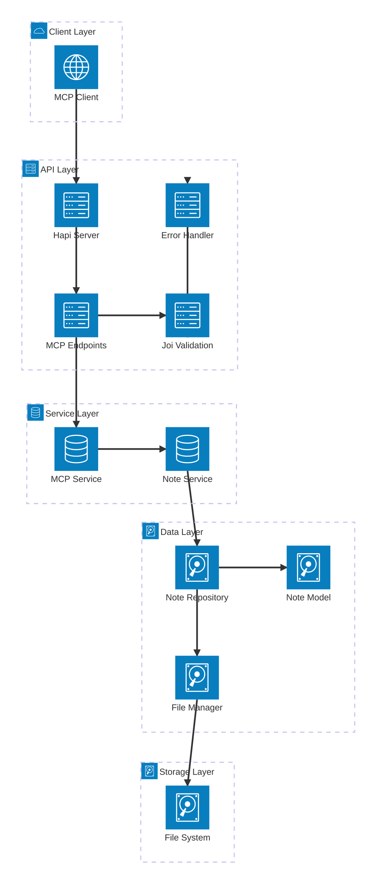

# MCP Integration with Hapi.js - Complete Guide

This document captures the key learnings from integrating the [Model Context Protocol (MCP)](https://github.com/modelcontextprotocol/typescript-sdk) with a Hapi.js backend server, including the challenges encountered and their solutions.

## Table of Contents

- [Overview](#overview)
- [The Challenge](#the-challenge)
- [Issues Encountered](#issues-encountered)
- [Solution Approach](#solution-approach)
- [Implementation Details](#implementation-details)
- [Best Practices](#best-practices)
- [Testing](#testing)
- [Future Recommendations](#future-recommendations)

## Overview

The Model Context Protocol (MCP) enables AI assistants to securely connect to local and remote resources. This project successfully integrates MCP with a Hapi.js REST API backend to provide note management capabilities through the MCP protocol.

### Architecture
- **Backend**: Node.js with Hapi.js framework
- **MCP Server**: Direct JSON-RPC implementation (following enterprise patterns)
- **Storage**: File-based repository pattern with service layer
- **Protocol**: JSON-RPC over HTTP at `/mcp`
- **Architecture**: Repository Pattern, Service Layer, Domain-Driven Design

## Understanding the MCP Protocol

The Model Context Protocol (MCP) is a standardized way to connect AI applications with external data sources and tools. It is built on JSON-RPC 2.0, enabling seamless communication between clients and servers.

### Key Features of MCP

1. **Resources**: Provide data to AI models, similar to GET endpoints in REST APIs.
2. **Tools**: Execute actions or computations, akin to POST endpoints.
3. **Prompts**: Define reusable templates for AI interactions.
4. **Sampling**: Allow servers to request LLM completions.
5. **Elicitation**: Enable servers to request additional user input.

### JSON-RPC Foundation

MCP uses JSON-RPC 2.0 for its message structure, ensuring a lightweight and stateless communication protocol.

#### Example JSON-RPC Request
```json
{
  "jsonrpc": "2.0",
  "method": "initialize",
  "params": { "protocolVersion": "2025-06-18" },
  "id": 1
}
```

#### Example JSON-RPC Response
```json
{
  "jsonrpc": "2.0",
  "result": {
    "protocolVersion": "2025-06-18",
    "capabilities": { "tools": {}, "resources": {}, "prompts": {} }
  },
  "id": 1
}
```

### Security and Trust

MCP emphasizes user consent, data privacy, and tool safety. Implementers must ensure robust security measures and clear user authorization flows.

### Learn More

For detailed specifications and examples, visit:

- [MCP Official Website](https://modelcontextprotocol.io)
- [MCP Specification (2025-06-18)](https://modelcontextprotocol.io/specification/2025-06-18)
- [MCP TypeScript SDK](https://github.com/modelcontextprotocol/typescript-sdk?tab=readme-ov-file#streamable-http)

## The Challenge

Integrating MCP with Hapi.js presented unique challenges due to the need for:

- Adhering to the MCP protocol specifications
- Implementing JSON-RPC over HTTP in a Hapi.js environment
- Managing state and sessions for MCP connections
- Ensuring secure and efficient communication between AI assistants and backend services

## Issues Encountered

### 1. Transport Layer Conflicts

**Problem**: Initial attempts to use `StreamableHTTPServerTransport` failed because:
- Hapi.js was already processing HTTP requests
- The transport expected raw Node.js request/response objects
- Payload parsing conflicts between Hapi and MCP transport
- Request ID collisions in concurrent scenarios

**Error Examples**:
```
Error POSTing to endpoint (HTTP 500): {"jsonrpc":"2.0","error":{"code":-32603,"message":"Internal server error"},"id":null}

Not Acceptable: Client must accept both application/json and text/event-stream

Parse error: Invalid literal value, expected "2.0"
```

### 2. Payload Processing Issues

**Problem**: When using `StreamableHTTPServerTransport`:
- Setting `payload: { parse: false }` caused JSON to be treated as Buffer
- Setting `payload: { parse: true }` caused conflicts with transport expectations
- The transport's `handleRequest` method expected unprocessed requests

### 3. Session Management Complexity

**Problem**: `StreamableHTTPServerTransport` includes session management that was unnecessary for our stateless use case and added complexity.

## Solution Approach

### MCP Protocol Compliance Verification

**✅ Our implementation fully complies with MCP protocol** as defined in the [official specification](https://github.com/modelcontextprotocol/typescript-sdk). Here's the compliance checklist:

#### Required MCP Methods ✅
- ✅ **`initialize`**: Returns server capabilities and info
- ✅ **`tools/list`**: Lists available tools with schemas  
- ✅ **`tools/call`**: Executes tools and returns results
- ✅ **`notifications/initialized`**: Handles initialization complete

#### JSON-RPC 2.0 Compliance ✅
- ✅ **Request Structure**: Validates `jsonrpc`, `method`, `id` fields
- ✅ **Response Structure**: Returns `jsonrpc`, `result`/`error`, `id`
- ✅ **Error Codes**: Uses standard codes (-32600, -32602, -32603)
- ✅ **Content Type**: Accepts and returns `application/json`

#### MCP-Specific Requirements ✅
- ✅ **Protocol Version**: Returns `"2024-11-05"` in initialize
- ✅ **Capabilities**: Declares `tools: {}` capability
- ✅ **Tool Schemas**: Provides JSON Schema for tool inputs
- ✅ **Content Format**: Returns `content: [{ type: 'text', text: '...' }]`

#### Validation Test
```bash
# This request/response cycle proves full compliance:

# Request (standard MCP initialize)
curl -X POST http://localhost:3000/mcp \
  -H "Content-Type: application/json" \
  -d '{"jsonrpc": "2.0", "method": "initialize", "params": {"protocolVersion": "2024-11-05", "capabilities": {}, "clientInfo": {"name": "test", "version": "1.0"}}}'

# Response (compliant MCP response)
{
  "jsonrpc": "2.0",
  "result": {
    "protocolVersion": "2024-11-05",
    "capabilities": { "tools": {}, "prompts": {}, "resources": {} },
    "serverInfo": { "name": "notes-server", "version": "1.0.0" }
  },
  "id": 1
}
```

### When to Use Each Approach

#### Use Direct JSON-RPC Implementation When:
- ✅ **Integrating with existing enterprise applications** (like our Hapi.js project)
- ✅ **Have established architectural patterns** (Repository, Service Layer, Domain-Driven Design)
- ✅ **Need tight integration** with existing middleware and auth systems
- ✅ **Want full control** over request/response handling
- ✅ **Team familiarity** with the existing framework is high
- ✅ **Stateless architecture** preferred for horizontal scaling

#### Use StreamableHTTPServerTransport When:
- ✅ **Building new MCP-focused services** without existing framework constraints
- ✅ **Need SSE streaming** for server-to-client notifications
- ✅ **Want automatic session management** and resumability features
- ✅ **Prefer SDK-managed protocol compliance** and lifecycle management
- ✅ **Building standalone MCP servers** from scratch
- ✅ **Need stateful sessions** with resumable connections

### Alternative Implementation: Hapi.js + StreamableHTTPServerTransport

For reference, here's how you **could** integrate `StreamableHTTPServerTransport` with Hapi.js:

```javascript
// src/mcp/endpoints/mcp-transport.js
import { randomUUID } from 'node:crypto'
import { McpServer } from '@modelcontextprotocol/sdk/server/mcp.js'
import { StreamableHTTPServerTransport } from '@modelcontextprotocol/sdk/server/streamableHttp.js'
import { isInitializeRequest } from '@modelcontextprotocol/sdk/types.js'

const transports = {}

async function handleMcpTransport(request, h) {
  const sessionId = request.headers['mcp-session-id']
  let transport

  if (sessionId && transports[sessionId]) {
    // Reuse existing transport
    transport = transports[sessionId]
  } else if (!sessionId && isInitializeRequest(request.payload)) {
    // Create new transport with session management
    transport = new StreamableHTTPServerTransport({
      sessionIdGenerator: () => randomUUID(),
      onsessioninitialized: (sessionId) => {
        transports[sessionId] = transport
      },
      enableDnsRebindingProtection: true,
      allowedHosts: ['127.0.0.1']
    })

    // Clean up on close
    transport.onclose = () => {
      if (transport.sessionId) {
        delete transports[transport.sessionId]
      }
    }

    // Create MCP server and connect
    const server = new McpServer({
      name: 'notes-server',
      version: '1.0.0'
    })

    // Register tools, resources, prompts
    // ... (same as our service layer)

    await server.connect(transport)
  } else {
    return h.response({
      jsonrpc: '2.0',
      error: { code: -32000, message: 'Bad Request: No valid session ID' },
      id: null
    }).code(400)
  }

  // Let transport handle the request
  await transport.handleRequest(request.raw.req, request.raw.res, request.payload)
  
  // Return h.abandon() since transport handles the response
  return h.abandon
import { createMcpProtocolError } from '../../../../common/errors/domain-errors.js'

const mcpTransportRoutes = [
  {
    method: 'POST',
    path: '/mcp',
    handler: handleMcpTransport,
    options: {
      payload: { parse: true }
    }
  },
  {
    method: 'GET',
    path: '/mcp',
    handler: handleMcpTransport
  },
  {
    method: 'DELETE',
    path: '/mcp',
    handler: handleMcpTransport
  }
]

export { mcpTransportRoutes }
```

**This approach would provide:**
- ✅ Automatic session management and resumability
- ✅ SSE streaming for server-to-client notifications  
- ✅ Built-in protocol compliance validation
- ✅ SDK-managed connection lifecycle

**But would require:**
- ❌ Using `h.abandon()` which bypasses Hapi's response handling
- ❌ Less integration with existing enterprise patterns
- ❌ More complex debugging across framework and transport layers
- ❌ Additional complexity in error handling and logging

### Real-World Examples

#### Our Hapi.js Implementation (Direct JSON-RPC with Enterprise Patterns)
```javascript
// Clean integration with Hapi's ecosystem following enterprise patterns
{
  method: 'POST',
  path: '/mcp',
  handler: handleMcpRequest,
  options: {
    description: 'Handle MCP JSON-RPC requests',
    notes: 'Processes Model Context Protocol requests via JSON-RPC',
    tags: ['api', 'mcp'],
    validate: { payload: mcpRequestSchema }, // Joi validation
    auth: 'jwt-strategy',                    // Hapi auth integration
    pre: [{ method: rateLimiter }]           // Hapi middleware
  }
}

// Handler follows enterprise patterns
async function handleMcpRequest(request, h) {
  try {
    const mcpService = request.server.app.mcpService // Service injection
    
    // Route to service layer method
    switch (request.payload.method) {
      case 'initialize':
        return h.response(await mcpService.initialize(request.payload.params))
      case 'tools/call':
        return h.response(await mcpService.callTool(request.payload.params, request.payload.id))
    }
  } catch (error) {
    request.logger.error('MCP request error:', error)
    throw Boom.internal(`MCP request failed: ${error.message}`)
  }
}
```

#### Express + StreamableHTTPServerTransport (SDK Example)
```javascript
// Direct SDK integration with session management
import express from "express";
import { McpServer } from "@modelcontextprotocol/sdk/server/mcp.js";
import { StreamableHTTPServerTransport } from "@modelcontextprotocol/sdk/server/streamableHttp.js";

const app = express();
app.use(express.json());

const transports = {};

app.post('/mcp', async (req, res) => {
  const sessionId = req.headers['mcp-session-id'];
  let transport;

  if (sessionId && transports[sessionId]) {
    transport = transports[sessionId];
  } else if (!sessionId && isInitializeRequest(req.body)) {
    transport = new StreamableHTTPServerTransport({
      sessionIdGenerator: () => randomUUID(),
      onsessioninitialized: (sessionId) => {
        transports[sessionId] = transport;
      }
    });

    const server = new McpServer({ name: 'notes', version: '1.0.0' });
    server.registerTool('create_note', schema, handler);
    await server.connect(transport);
  }

  await transport.handleRequest(req, res, req.body);
});
```

#### Hapi.js + StreamableHTTPServerTransport (Alternative Approach)
```javascript
// Hybrid approach using SDK transport with Hapi framework
async function handleMcpTransport(request, h) {
  const sessionId = request.headers['mcp-session-id'];
  let transport;

  if (sessionId && transports[sessionId]) {
    transport = transports[sessionId];
  } else if (isInitializeRequest(request.payload)) {
    transport = new StreamableHTTPServerTransport({
      sessionIdGenerator: () => randomUUID(),
      onsessioninitialized: (sessionId) => {
        transports[sessionId] = transport;
      }
    });

    const server = new McpServer({ name: 'notes', version: '1.0.0' });
    // Could integrate with existing services here
    await server.connect(transport);
  }

  // Let transport handle the request/response
  await transport.handleRequest(request.raw.req, request.raw.res, request.payload);
  return h.abandon; // Bypass Hapi's response handling
}
```

### Architecture Overview

The following diagram illustrates the complete architecture of our MCP integration with Hapi.js following enterprise patterns:



**Flow Description:**
1. **MCP Client** sends JSON-RPC requests over HTTP POST to `/mcp`
2. **Hapi Server** routes requests to MCP endpoints with built-in middleware
3. **MCP Endpoints** handle HTTP-to-JSON-RPC conversion and route method calls
4. **Joi Validation** validates request structure and parameters
5. **MCP Service** implements JSON-RPC protocol and routes tool calls
6. **Note Service** handles business logic for note operations
7. **Note Repository** manages data access using Repository Pattern
8. **File Manager** handles file I/O operations with the file system

**Refactored Architecture Layers:**
- **Endpoints**: `/mcp/endpoints/mcp.js` - HTTP route handlers with Boom error handling
- **Services**: `/mcp/services/mcp.js` - Business logic for MCP operations
- **Note Services**: `/mcp/v1/notes/services/note.js` - Note-specific business logic
- **Repository**: `/src/data/repositories/note.js` - Data access layer with FileManager
- **Models**: `/src/data/models/note.js` - Domain models with validation
- **Utilities**: `/src/data/utils/note-parser.js` - File parsing without static methods
- **Schemas**: `/mcp/schemas/mcp.js` - Joi validation schemas
- **Errors**: `/src/common/errors/domain-errors.js` - Domain-specific error classes

## Implementation Details

### 1. Route Structure

```javascript
// src/mcp/endpoints/mcp.js
import Boom from '@hapi/boom'
import { McpService } from '../services/mcp.js'
import { mcpRequestSchema } from '../schemas/mcp.js'

/**
 * Handler for POST /mcp
 * Handle MCP JSON-RPC requests
 */
async function handleMcpRequest(request, h) {
  try {
    const mcpService = request.server.app.mcpService
    const payload = request.payload

    // Route based on JSON-RPC method
    switch (payload.method) {
      case 'initialize':
        return h.response(await mcpService.initialize(payload.params)).code(200)
      
      case 'tools/list':
        return h.response(await mcpService.listTools()).code(200)
      
      case 'tools/call':
        return h.response(await mcpService.callTool(payload.params, payload.id)).code(200)
      
      default:
        return h.response({
          jsonrpc: '2.0',
          error: { code: -32601, message: `Method not found: ${payload.method}` },
          id: payload.id
        }).code(404)
    }
  } catch (error) {
    request.logger.error('MCP request error:', error)
    throw Boom.internal(`MCP request failed: ${error.message}`)
  }
}

const mcpRoutes = [
  {
    method: 'POST',
    path: '/mcp',
    handler: handleMcpRequest,
    options: {
      description: 'Handle MCP JSON-RPC requests',
      notes: 'Processes Model Context Protocol requests via JSON-RPC',
      tags: ['api', 'mcp'],
      validate: {
        payload: mcpRequestSchema
      }
    }
  }
]

export { mcpRoutes }
```

### 2. MCP Service Layer

#### MCP Service Implementation
```javascript
// src/mcp/services/mcp.js
import { McpProtocolError } from '../../../../common/errors/domain-errors.js'

class McpService {
  constructor(noteService) {
    this.noteService = noteService
    this.logger = createLogger()
  }

  async initialize(params) {
    return {
      jsonrpc: '2.0',
      result: {
        protocolVersion: '2024-11-05',
        capabilities: { tools: {}, prompts: {}, resources: {} },
        serverInfo: { name: 'notes-server', version: '1.0.0' }
      }
    }
  }

  async listTools() {
    return {
      jsonrpc: '2.0',
      result: {
        tools: [
          {
            name: 'create_note',
            description: 'Create a new note with title and content',
            inputSchema: {
              type: 'object',
              properties: {
                title: { type: 'string', minLength: 1, maxLength: 255 },
                content: { type: 'string', maxLength: 10000 }
              },
              required: ['title', 'content'],
              additionalProperties: false
            }
          },
          {
            name: 'get_note',
            description: 'Retrieve a note by its unique ID',
            inputSchema: {
              type: 'object',
              properties: {
                noteId: { type: 'string', pattern: '^note_\\d+_[a-z0-9]+$' }
              },
              required: ['noteId'],
              additionalProperties: false
            }
          },
          {
            name: 'list_notes',
            description: 'List all available notes with their metadata',
            inputSchema: { type: 'object', additionalProperties: false }
          }
        ]
      }
    }
  }

  async callTool(params, requestId) {
    const { name: toolName, arguments: toolArguments } = params

    switch (toolName) {
      case 'create_note':
        return await this._executeCreateNote(toolArguments, requestId)
      case 'get_note':
        return await this._executeGetNote(toolArguments, requestId)
      case 'list_notes':
        return await this._executeListNotes(toolArguments, requestId)
      default:
        throw new McpProtocolError(`Unknown tool: ${toolName}`)
    }
  }

  async _executeCreateNote(args, requestId) {
    const { title, content } = args
```
